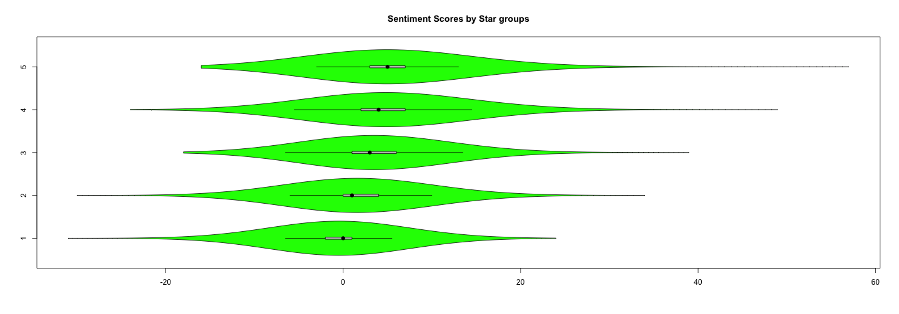

What contributes to high Restaurant Ratings?
========================================================
author: Edwin Seah
date: 22 Nov 2015

#### JHU Data Science Specialization Capstone, Nov 2015

Background Introduction
========================================================

Restaurants and eating establishments form a large portion of businesses listed on Yelp! and are frequently reviewed. 

Tourists and locals both habitually turn online to determine if a place is worth eating at, especially one they had never previously visited. 

In order to draw a highly-rated review or rating, do attributes in Yelp's listings even matter?

Questions of Interest
========================================================

What contributes the most:
- What Attributes(characteristics) are desirable?
- Are they consistent across different locations?
- Does it matter which days it is open/closed?

How we check:
- A useful model that predicts ratings based on attributes/open days/review sentiment

Why should one care:
- Attributes that pull in customers can be used to suggest improvements to businesses (e.g. stop making people pay for Wi-Fi?)

Methods
========================================================

a) Classification (Rpart/GBM) Error estimates for attributes + opening hours, and attributes only


```
      ErrEst(%).all ErrEst(%).attributesOnly
Rpart          71.5                     70.6
GBM            69.5                     67.2
```

b) Review Sentiment Scores banding evident:

 

Results
========================================================

#### Conclusion:
- Disapppointing results (high error rates) a model-based approach
- Insufficient data usable to train any classification model based simply on business attributes alone.
- Sentiment can be quantitatively discerned from review text

#### Ideas:
- Restaurants should concentrate on getting reviews from performing their core function well (GOOD FOOD)
- Attracts favourable reviews, which then get reflected in higher user ratings
- Non-food related businesses will not produce a good model based on business attributes either
- Investigate additional NLP and qualitative factorization of review and user contributed text
